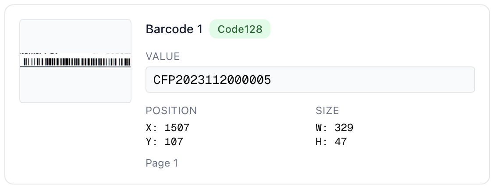

## Overview

Cardinal automatically detects and extracts **barcodes** during processing.  

For each detected barcode, you'll receive:  

- **`image_url`** – a cropped image of the detected barcode.  
- **`bounding_box`** – exact coordinates (`x_min`, `y_min`, `x_max`, `y_max`, plus `width` and `height`).  
- **`original_polygon`** – polygon coordinates for the barcode region.  
- **`barcode_type`** – e.g., `Code128`, `QR_CODE`, `EAN_13`.  
- **`barcode_value`** – decoded string from the barcode.  
- **`page_number`** – the page where the barcode was found.  
- **`confidence`** – detection confidence score.  
- **`barcode_index`** – index of the barcode on the page.  


*Example: Detected barcode and accompanying metadata*

---

## How to Enable

To enable barcode extraction, set `barcodeDetect: true` in your API request.

- Default: `barcodeDetect = false`  
- To **enable** barcode extraction, set `barcodeDetect = true`.  
- ⚠️ Enabling barcode extraction will **add latency** to your requests, since additional detection passes are run.  

---

## Example Response

```json
{
  "barcodes": [
    {
      "image_url": "",
      "bounding_box": {
        "x_min": 1506.6869,
        "y_min": 107.3429,
        "x_max": 1835.3657,
        "y_max": 154.0509,
        "width": 328.6787,
        "height": 46.7080
      },
      "original_polygon": [
        7.5815,
        0.5861,
        9.1245,
        0.5861,
        9.1245,
        0.7195,
        7.5815,
        0.7195
      ],
      "barcode_type": "Code128",
      "barcode_value": "CFP2023112000005",
      "page_number": 1,
      "confidence": 1.0,
      "barcode_index": 1
    }
  ]
}
```

<Note> Bounding box coordinates are provided in the same unit system as other page geometry. Use `page.width` and `page.height` from the response to normalize values if you need to scale to your viewer. </Note>