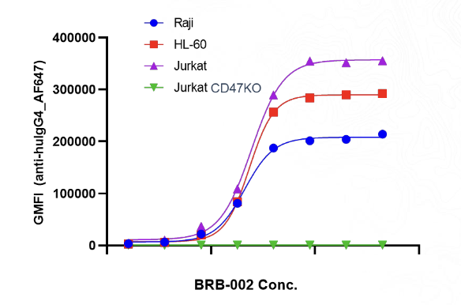
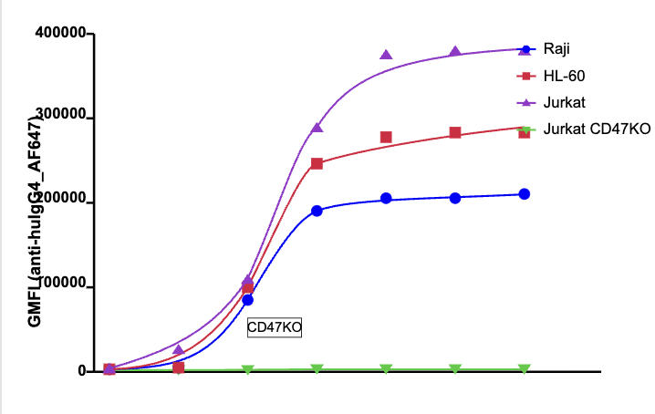

## Overview

Cardinal can automatically **digitize figures** (charts, graphs, plots) within documents into HTML format.

For each digitized figure, you'll receive:

- **`digitized_html`** – HTML representation of the chart/graph data.
- **`bounding_box`** – coordinates of the figure location in the original document.


*Example: Original Figure*

*Example: After Digitization*

---

## How to Enable

To enable figure digitization, set `digitizeFigures: true` in your API request.

- Default: `digitizeFigures = false`
- To **enable** figure digitization, set `digitizeFigures = true`.
- ⚠️ Enabling figure digitization will **add latency** to your requests, since additional processing passes are run.

---

## Example Response

The digitized figures will appear in the `pages` array, with each page containing a `digitized_figures` array:

```json
{
  "pages": [
    {
      "digitized_figures": [
        {
          "digitized_html": "<html>...</html>",
          "bounding_box": {
            "x": 100,
            "y": 200,
            "width": 400,
            "height": 300
          }
        }
      ]
    }
  ]
}
```

<Note> Figure digitization is processed alongside other document elements and accessed through the same `/markdown` endpoint. </Note>