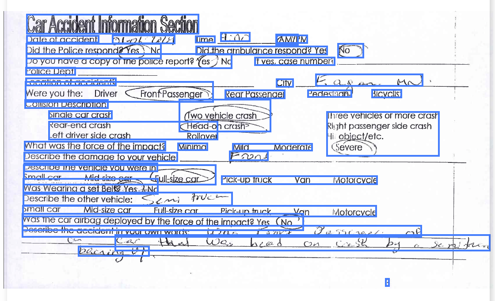

### TL;DR

Get precise chunks for your retrieval and embedded workflows. 


*Example: Document with detected bounding boxes highlighting different content regions*

---

### Endpoint

**POST** `https://api.trycardinal.ai/split`  
**Content-Type:** `multipart/form-data`  
**Auth:** `X-API-KEY: <API_KEY>`

> You may provide **either** `file` **or** `fileUrl`.

---

### Example Response 

```json 
{
  "pages": [
    {
      "page": 1,
      "width": 612,
      "height": 792,
      "bounding_boxes": [
        {
          "bounding_box": {
            "min_x": 1.2558,
            "min_y": 0.9282,
            "max_x": 2.4513,
            "max_y": 1.1343
          },
          "content": "Test"
        },
        {
          "bounding_box": {
            "min_x": 2.6974,
            "min_y": 1.2862,
            "max_x": 4.9843,
            "max_y": 1.4512
          },
          "content": "Text!"
        }
      ]
    }
  ]
}
```

**Fields**
- `width`, `height` — page size in points (1 inch = 72 points)
- `bounding_boxes[].bounding_box` — box in inches (min_x, min_y, max_x, max_y)
- `bounding_boxes[].content` — text captured for that region

---

### Units

Bounding boxes are returned in **inches**, relative to the original PDF coordinate system.

- Origin: **top-left** of the page  
- Format: `(min_x, min_y, max_x, max_y)` → inches  

You’ll also see `width` and `height` (in points) for each page in the response.  

> 💡 **Recommended workflow**:  
> 1. Convert inches → points (multiply by 72).  
> 2. Normalize by the PDF’s page size in points (`width` and `height` from the response).  
> 3. Convert to percentages for rendering highlights.  

This ensures bounding boxes scale correctly across different PDF sizes (e.g., 600–800 point wide pages).

---

### Conversion Example

Here’s how you can implement the recommended workflow on the frontend:

```ts
const convertExtractedDataToHighlightAreas = (): HighlightArea[] => {
  const boundingBoxData = Array.isArray(extractedData)
    ? extractedData
    : extractedData?.pages?.[currentPage - 1]?.bounding_boxes;

  if (!boundingBoxData || boundingBoxData.length === 0) {
    console.log('No bounding box data found');
    return [];
  }

  const INCHES_TO_POINTS = 72;

  return boundingBoxData.map((box: any, index: number) => {
    // Convert from inches to points
    const xInPoints = box.bounding_box.min_x * INCHES_TO_POINTS;
    const yInPoints = box.bounding_box.min_y * INCHES_TO_POINTS;
    const widthInPoints = (box.bounding_box.max_x - box.bounding_box.min_x) * INCHES_TO_POINTS;
    const heightInPoints = (box.bounding_box.max_y - box.bounding_box.min_y) * INCHES_TO_POINTS;

    // Convert to percentages relative to PDF dimensions
    const leftPercent = (xInPoints / pdfWidth) * 100;
    const topPercent = (yInPoints / pdfHeight) * 100;
    const widthPercent = (widthInPoints / pdfWidth) * 100;
    const heightPercent = (heightInPoints / pdfHeight) * 100;

    return {
      pageIndex: currentPage - 1,
      left: Math.max(0, Math.min(100, leftPercent)),
      top: Math.max(0, Math.min(100, topPercent)),
      width: Math.max(0, Math.min(100 - leftPercent, widthPercent)),
      height: Math.max(0, Math.min(100 - topPercent, heightPercent)),
    };
  });
};
```

### API Reference

<Card title="RAG API" href="api-reference/endpoint/rag" icon="code" />

### Coming Soon
- **Variable chunking** — flexible bounding box grouping (not just paragraphs or words).
